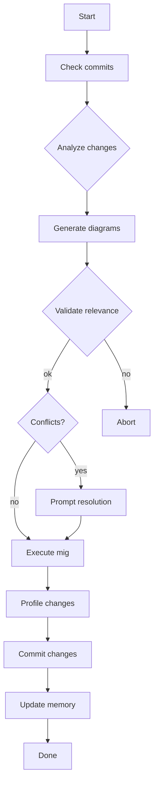

Spec: Migrates source→target with change analysis + diagram generation

## Structure

```
branch-migrator/SKILL.md
├── local-memory.md
└── references/
    ├── git-commands.md
    ├── diagram-generation.md
    └── quality-checks.md
```

## Intent

Analyze, visualize, and validate branch migrations safely.

## Workflow



## Rules

| Check | Rule |
|-------|------|
| commands | Generic git only (no `-f`, `--force`) |
| destructive | Require user confirmation before execute |
| brch names | Use placeholders (`$SOURCE`, `$TARGET`) |
| staleness | Detect if HEAD ≠ last_commit_hash |
| conflicts | Auto-detect, prompt for resolution |

## Local Memory

```yaml
last_migration: <dt>
source_branch: <str>
target_branch: <str>
last_commit_hash: <sha>
migration_status: pending|completed|failed
conflicts_resolved: bool
staleness_note: <str|null>
```

## Commands

| Category | Purpose |
|----------|---------|
| discovery | `git log`, `git diff`, branch inspection |
| migration | cherry-pick, merge strategies, conflict resolution |
| diagrams | generate commit graphs, change visualizations |
| quality | syntax check, test validation, profile analysis |

## Compression

| Method | Example |
|--------|---------|
| Abbreviate | `branch→brch`, `commit→cmt`, `migration→mig` |
| Inline | `1-1024 chars` → `1-1024c` |
| Pipe map | `pending: awaiting user`, `completed: done` |
| Mermaid | Flows with 3+ branches (see Workflow) |

**Target**: <100 lines | extended → `references/`

## Refs

- [git commands](references/git-commands.md)
- [diagrams](references/diagram-generation.md)
- [quality checks](references/quality-checks.md)
