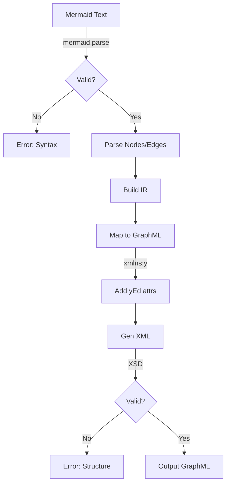
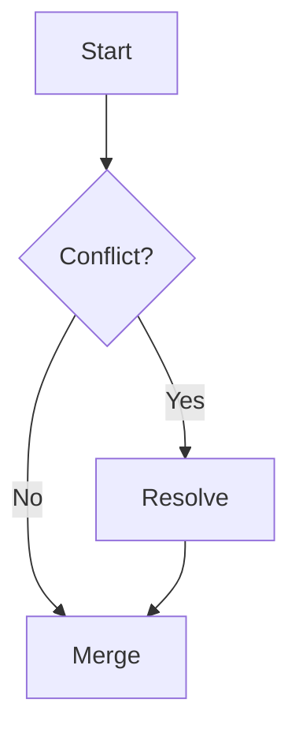
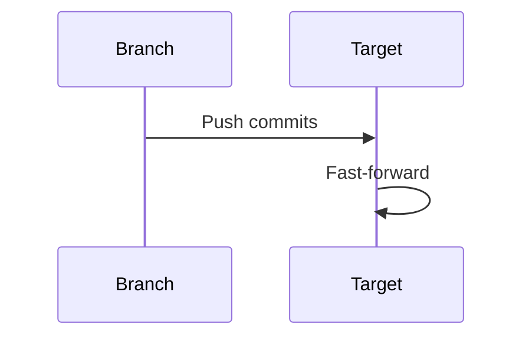
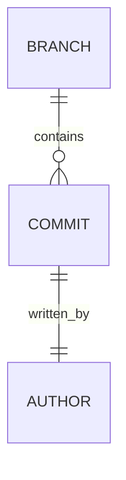

# Diagram Generation Reference

## Mermaid API

| Method | Purpose | Usage |
|--------|---------|-------|
| `mermaid.render(id, text)` | Render diagram to SVG | `await mermaid.render('diagram-id', 'graph TD; A-->B;')` |
| `mermaid.parse(text)` | Validate syntax | `mermaid.parse('graph TD; A-->B;')` → true/false |
| `mermaid.initialize(config)` | Setup config | `mermaid.initialize({ startOnLoad: false })` |

**Pattern:**
```js
const valid = await mermaid.parse(mermaidText);
if (!valid) throw new Error('Invalid Mermaid');
const { svg } = await mermaid.render('svg-id', mermaidText);
```

## GraphML Structure

**Root:**
```xml
<graphml xmlns="http://graphml.graphdrawing.org/xmlns"
         xmlns:y="http://www.yworks.com/xml/graphml">
  <key id="d0" for="node" yfiles.type="nodegraphics"/>
  <key id="d1" for="edge" yfiles.type="edgegraphics"/>
  <graph id="G" edgedefault="directed">
    <!-- nodes and edges -->
  </graph>
</graphml>
```

**Node:**
```xml
<node id="node-id">
  <data key="d0">
    <y:ShapeNode>
      <y:Geometry x="100" y="100" width="100" height="50"/>
      <y:Fill color="#FFCC00" transparent="false"/>
      <y:NodeLabel>Label</y:NodeLabel>
    </y:ShapeNode>
  </data>
</node>
```

**Edge:**
```xml
<edge source="source-id" target="target-id">
  <data key="d1">
    <y:PolyLineEdge>
      <y:EdgeLabel>Label</y:EdgeLabel>
    </y:PolyLineEdge>
  </data>
</edge>
```

## yEd Extensions

| Element | Purpose | Required Attrs |
|---------|---------|----------------|
| `xmlns:y` | yEd namespace | `http://www.yworks.com/xml/graphml` |
| `<y:ShapeNode>` | Standard node shapes | type (rect, circle, diamond) |
| `<y:GenericNode>` | Custom shapes | configuration |
| `<y:EdgeLabel>` | Edge labels | position |
| `<y:Geometry>` | Position/size | x, y, width, height |
| `<y:Fill>` | Fill color | color, transparent |
| `<y:BorderStyle>` | Border style | color, type, width |

**Complete Node Example:**
```xml
<node id="commit-abc">
  <data key="d0">
    <y:ShapeNode>
      <y:Geometry x="200" y="150" width="120" height="60"/>
      <y:Fill color="#88CCEE" transparent="false"/>
      <y:BorderStyle color="#000000" type="line" width="1.0"/>
      <y:NodeLabel>Commit ABC</y:NodeLabel>
    </y:ShapeNode>
  </data>
</node>
```

## Conversion Workflow



**IR Structure:**
```ts
interface DiagramIR {
  nodes: Array<{
    id: string
    label: string
    x: number; y: number
    width: number; height: number
    color?: string
    shape?: 'rect' | 'circle' | 'diamond'
  }>
  edges: Array<{
    source: string
    target: string
    label?: string
    style?: 'solid' | 'dashed' | 'dotted'
  }>
}
```

## Validation Techniques

| Method | Purpose | Tool |
|--------|---------|------|
| `mermaid.parse(text)` | Mermaid syntax | Mermaid API |
| XSD validation | GraphML structure | `xmllint --schema graphml-structure.xsd` |
| Element check | Required nodes/edges | Custom validator |
| Attribute check | yEd extensions | XPath queries |

**Validation Script:**
```js
async function validateMermaid(text) {
  try {
    const valid = await mermaid.parse(text);
    return valid ? 'OK' : 'Syntax Error';
  } catch (e) {
    return `Parse Error: ${e.message}`;
  }
}

function validateGraphML(xml) {
  const parser = new DOMParser();
  const doc = parser.parseFromString(xml, 'application/xml');
  const errors = doc.getElementsByTagName('parsererror');
  return errors.length === 0 ? 'OK' : 'XML Error';
}
```

## Common Patterns

**Flowchart (git history):**


**Sequence Diagram:**


**Entity Relationship:**


**Mermaid → GraphML Mapping:**
| Mermaid | GraphML | yEd Element |
|---------|---------|-------------|
| `graph TD` | `<graph edgedefault="directed">` | - |
| `A-->B` | `<edge source="A" target="B"/>` | `<y:PolyLineEdge>` |
| `A[Label]` | `<node id="A"><data key="label">Label</data></node>` | `<y:NodeLabel>` |
| `classDef` | `<data key="style">` | `<y:Fill>`, `<y:BorderStyle>` |

## Tips

- Auto-layout nodes if Mermaid doesn't provide coordinates
- Default node size: 100×50, default edge color: black
- Use `yfiles.type="nodegraphics"` for nodes, `edgegraphics` for edges
- Preserve Mermaid IDs in GraphML node IDs for debugging
- Validation before rendering prevents runtime errors
