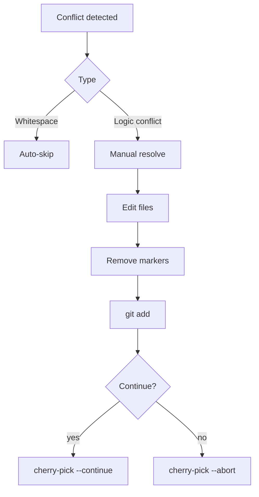

# Git Commands Reference

Branch migration patterns with analysis, conflict handling, and performance optimization.

## Discovery

| Command | Purpose | Example |
|---------|---------|---------|
| `git log $SOURCE..$TARGET` | Find commits in $TARGET not in $SOURCE | `git log feature..main` |
| `git log --oneline --graph` | Visualize branch topology | `git log --oneline --graph --all` |
| `git branch -vv` | Show tracking brch + last cmt | `git branch -vv` |
| `git rev-parse $BRANCH` | Get SHA of brch tip | `git rev-parse main` |

### Range Patterns

- `A..B` = reachable from B, not A (excludes ancestors)
- `A...B` = symmetric diff (A ∪ B) - (A ∩ B)
- `--not A B` = negation: exclude A and B

## Commit Analysis

| Command | Purpose | Output |
|---------|---------|--------|
| `git show $SHA` | Full cmt details (diff, msg, stats) | Full cmt info |
| `git diff-tree -r --name-status $SHA` | Changed files + status | `M path/to/file` |
| `git log --format="%H %s" $RANGE` | SHA + subject list | `abc123 fix: bug` |
| `git log --format="%aN %ae" $RANGE` | Author name/email | `John D <jd@ex.com>` |

### File Change Codes

| Code | Meaning |
|------|---------|
| `A` | Added |
| `M` | Modified |
| `D` | Deleted |
| `R` | Renamed (old→new) |
| `C` | Copied |
| `T` | Type changed |

## Migration

### Cherry-Pick

| Command | Use Case |
|---------|----------|
| `git cherry-pick $SHA` | Apply single cmt |
| `git cherry-pick $SHA1..$SHA2` | Apply range (inclusive) |
| `git cherry-pick -n $SHA` | Stage changes, no commit |
| `git cherry-pick --continue` | After conflict resolution |
| `git cherry-pick --abort` | Cancel operation |

**⚠️ Safety Notes**:
- Only use on clean working tree
- Verify cmt applies cleanly (no conflicts)
- Test in isolation first

### Rebase

| Command | Use Case |
|---------|----------|
| `git rebase $NEW_BASE` | Move current brch to $NEW_BASE |
| `git rebase --onto $NEW_BASE $UPSTREAM $BRANCH` | Rebase $BRANCH onto $NEW_BASE from $UPSTREAM |
| `git rebase -i $UPSTREAM` | Interactive rebase (squash, reorder, edit) |
| `git rebase --continue` | After conflict resolution |
| `git rebase --abort` | Cancel operation |
| `git rebase --skip` | Skip current cmt |

**⚠️ Safety Notes**:
- **NEVER** rebase shared/public brch
- Creates new SHA hashes (rewrite history)
- Backup before rebase: `git branch backup-$BRANCH`

## Conflict Resolution

### Detection

| Command | Purpose |
|---------|---------|
| `git status` | Show conflicted files |
| `git diff --check` | Detect whitespace conflicts |
| `grep -r "<<<<<<< HEAD" .` | Find conflict markers |

### Resolution Workflow



### Resolution Commands

| Command | Purpose |
|---------|---------|
| `git checkout --ours <file>` | Keep current brch version |
| `git checkout --theirs <file>` | Keep incoming cmt version |
| `git add <file>` | Mark as resolved |
| `git diff <base> <ours> <theirs>` | 3-way merge diff |

## Conventional Commits

### Format

```
type[optional scope]: description

[optional body]

[optional footer(s)]
```

### Types

| Type | Purpose | Example |
|------|---------|---------|
| `feat` | New feature | `feat(api): add user endpoint` |
| `fix` | Bug fix | `fix(auth): resolve token exp` |
| `docs` | Doc changes | `docs(readme): install guide` |
| `style` | Code style | `style(lint): fix indentation` |
| `refactor` | Code refactor | `refactor(core): extract utils` |
| `perf` | Performance | `perf(cache): add memoization` |
| `test` | Add/update tests | `test(auth): add unit tests` |
| `chore` | Maint tasks | `chore(deps): update libs` |

### Validation

| Command | Purpose |
|---------|---------|
| `git log --format="%s" | grep -E "^(feat|fix|docs|style|refactor|perf|test|chore)"` | Verify cmt msg format |
| `conventional-changelog-lint` | Linter (npm) |

## Performance

| Command | Purpose | Frequency |
|---------|---------|-----------|
| `git gc` | Compress repo, cleanup | Periodic (monthly) |
| `git maintenance start` | Enable scheduled tasks | One-time setup |
| `git maintenance run` | Run maintenance tasks | Manual trigger |
| `git repack -a -d --depth=250` | Optimize pack files | After large changes |
| `git prune-packed` | Remove loose objs | After repack |

### When to Run

- After large migrations (100+ commits)
- Repo size > 500MB
- Slow operations (`git status`, `git log`)
- Before backup/shipping

## Advanced Patterns

### Multiple Commits

```bash
# Cherry-pick range (SHA1 inclusive)
git cherry-pick $SHA1..$SHA2

# Select specific commits by SHA
git cherry-pick $SHA1 $SHA2 $SHA3

# Rebase entire branch onto new base
git rebase --onto $NEW_BASE $UPSTREAM $BRANCH
```

### Squashing

```bash
# Interactive rebase: combine last 3 commits
git rebase -i HEAD~3
# Change 'pick' to 'squash' for commits 2-3
```

### Bisect

```bash
# Binary search for bug introduction
git bisect start
git bisect bad          # Current state is broken
git bisect good $SHA     # Known good state
git bisect run <test-cmd>
```

## Safety Checklist

- [ ] Working tree clean before migration
- [ ] Verified commits exist in source (`git log`)
- [ ] No conflicts expected (check `git diff`)
- [ ] Backup created (`git branch backup-...`)
- [ ] Test changes in isolation
- [ ] Validate commit messages (conventional)
- [ ] Run tests after migration
- [ ] Update local-memory.md with migration status

## References

- [Git Cherry-Pick](https://git-scm.com/docs/git-cherry-pick)
- [Git Rebase](https://git-scm.com/docs/git-rebase)
- [Conventional Commits](https://www.conventionalcommits.org/)
- [Git Maintenance](https://git-scm.com/docs/git-maintenance)
