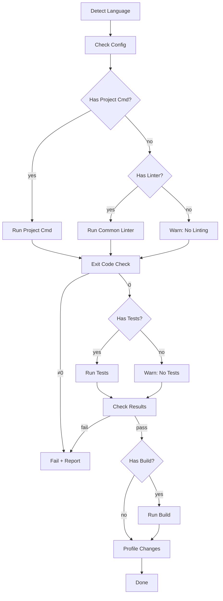

# Quality Validation Patterns

Generic validation patterns for branch migrations.

## Linting

| Command | Description | Language Hint |
|---------|-------------|---------------|
| `<project-lint>` | Run project's configured linter | Check `package.json`, `.eslintrc`, `pyproject.toml`, `.rubocop.yml` |
| `<common-linter>` | Fallback to common linter | `eslint`, `flake8`, `rubocop`, `gofmt` |

**Detection**: Scan for config files, use extension mapping:
- `.js/.ts/.tsx` → eslint/standard
- `.py` → flake8/pylint
- `.rb` → rubocop
- `.go` → gofmt

## Testing

| Command | Description | Language Hint |
|---------|-------------|---------------|
| `<project-test>` | Run project's test suite | Check `package.json`, `pytest.ini`, `spec_helper.rb`, `go.mod` |
| `<common-test>` | Fallback to standard test command | `npm test`, `pytest`, `rspec`, `go test ./...` |

**Detection**: Check for test config files, look for test directories (`tests/`, `spec/`, `__tests__/`).

## Build

| Command | Description | Language Hint |
|---------|-------------|---------------|
| `<project-build>` | Run project's build process | Check `package.json`, `Makefile`, `pom.xml`, `build.gradle` |
| `<common-build>` | Fallback to common build | `npm run build`, `cargo build`, `mvn compile`, `go build` |

**Detection**: Check for build scripts in config files, lockfiles (`package-lock.json`, `Cargo.lock`).

## Performance Profiling

| Method | Description | Tool |
|--------|-------------|------|
| `time <cmd>` | Measure execution time | Built-in |
| `<project-profile>` | Project-specific profiling | Check for `npm run profile`, `go test -bench=` |
| `memory-prof` | Memory usage tracking | Valgrind, pprof, memory_profiler |
| `cpu-prof` | CPU profiling | perf, pprof, cProfile |

**Detection**: Check for benchmark files (`*_bench.go`, `bench_*.py`), profiling config.

## Error Handling

| Pattern | Description |
|---------|-------------|
| `set -e` / `-x` | Exit on error, trace execution (bash) |
| `--fail-fast` | Stop on first test failure |
| `|| exit 1` | Explicit error propagation |
| Check exit codes | Verify command success before proceeding |

## Language Detection Table

| Extension | Language | Common Lint | Common Test | Common Build |
|-----------|----------|-------------|-------------|--------------|
| `.js`/`.ts`/`.tsx` | JS/TS | eslint | jest/vitest | webpack/vite |
| `.py` | Python | flake8 | pytest | setuptools/poetry |
| `.rb` | Ruby | rubocop | rspec | bundler/rake |
| `.go` | Go | gofmt | go test | go build |
| `.java` | Java | checkstyle | junit | maven/gradle |
| `.cpp`/`.c` | C/C++ | clang-format | catch2/gtest | cmake/make |

## Validation Flow



## Generic Command Template

```
# Language detection
$LANGUAGE = detect_from_extensions()
$CONFIG = find_config_file($LANGUAGE)

# Linting
if $CONFIG.has('lint'):
    exec($CONFIG.get('lint'))
elif has_common_linter($LANGUAGE):
    exec(get_common_linter($LANGUAGE))
else:
    warn("No linter found for $LANGUAGE")

# Testing
if $CONFIG.has('test'):
    exec($CONFIG.get('test'))
elif has_common_test($LANGUAGE):
    exec(get_common_test($LANGUAGE))
else:
    warn("No test suite found for $LANGUAGE")

# Build
if $CONFIG.has('build'):
    exec($CONFIG.get('build'))
elif has_common_build($LANGUAGE):
    exec(get_common_build($LANGUAGE))

# Profile
time exec("<migration-command>")
```
