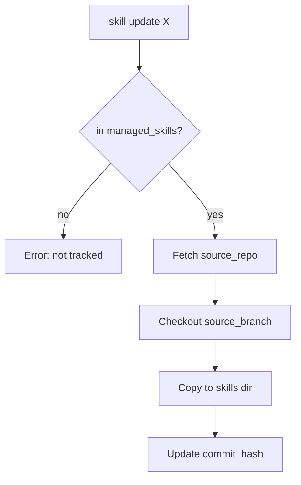
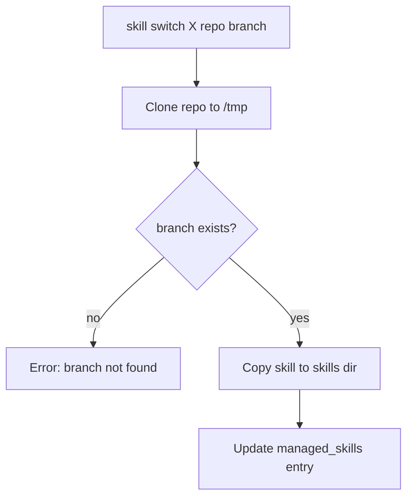

Spec: [agentskills.io](https://agentskills.io/specification)

## Structure

```
skill-name/SKILL.md    # required: name + description
├── scripts/           # optional
├── references/        # optional
└── assets/            # optional
```

## Rules

| Field | Constraint |
|-------|------------|
| name | `^[a-z0-9]+(-[a-z0-9]+)*$`, ≤64c, matches dir |
| description | 1-1024c, "what" + "when" |
| body | <500 lines |

## Commands

| Command | Description |
|---------|-------------|
| `skill create <name>` | Create new skill scaffold |
| `skill update <name>` | Update skill to HEAD of tracked branch |
| `skill update --all` | Update all managed skills |
| `skill switch <name> <repo> <branch>` | Change skill's source repo/branch |
| `skill sources` | List all tracked skill sources |
| `skill status [<name>]` | Show sync status (ahead/behind/stale) |

## Local Memory

`local-memory.md` tracks managed skills + their sources:

```yaml
managed_skills:
  <name>:
    source_repo: <git-url>
    source_branch: <branch>
    commit_hash: <sha>
    last_updated: <dt>
meta:
  last_updated: <dt>
  upgrade_permission: allowed|blocked
  upgrade_blocked_until: <date|null>
```

## Update Flow



## Switch Flow



## Status Check

Stale = remote HEAD ≠ local `commit_hash`

| Status | Meaning |
|--------|---------|
| synced | At tracked commit |
| behind | Remote has new commits |
| untracked | Not in managed_skills |

## Repo Format

Supported: `https://github.com/owner/repo` | `git@github.com:owner/repo` | local path

Branch: any valid git ref (branch, tag, commit SHA)

## Refs

- [compliance](references/compliance.md)
- [compression](references/compression.md)
- [memory format](references/local-memory-format.md)
