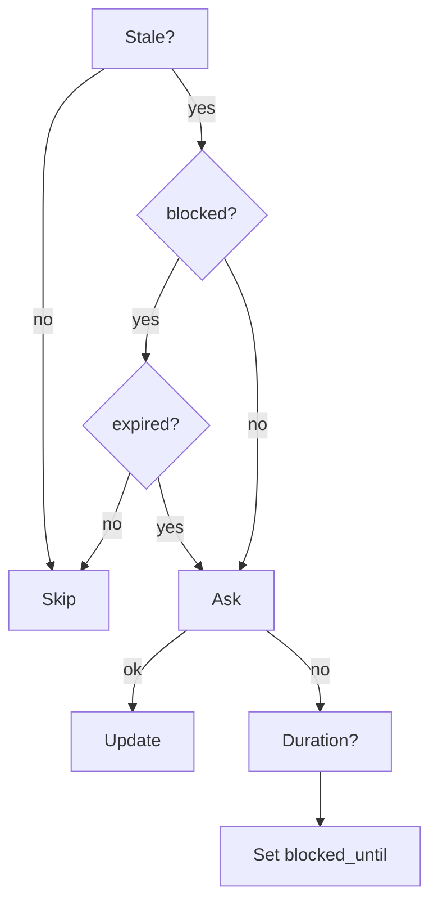

Spec: [agentskills.io](https://agentskills.io/specification)

## Structure

```
skill-name/SKILL.md    # required: name + description
├── scripts/           # optional
├── references/        # optional
└── assets/            # optional
```

## Rules

| Field | Constraint |
|-------|------------|
| name | `^[a-z0-9]+(-[a-z0-9]+)*$`, ≤64c, matches dir |
| description | 1-1024c, "what" + "when" |
| body | <500 lines |

## Local Memory

`local-memory.md` tracks project context + upgrade state:

```yaml
last_updated: <dt>
commit_hash: <sha>
upgrade_permission: allowed|blocked
upgrade_blocked_until: <date|null>
project_context: <notes>
```

## Upgrade Flow



Stale = `git rev-parse HEAD ≠ commit_hash`

## Placement

| Context | Store |
| Project-specific | `local-memory.md` |
| Skill-intrinsic | `SKILL.md` |

## Compression

Apply when creating/updating skills:

| Technique | Example |
|-----------|---------|
| Abbreviate | `chars→c`, `datetime→dt`, `string→str` |
| Drop headers | Remove if not structural |
| Inline tables | Explanations → columns |
| Single-line | `a \| b \| c` instead of list |
| Mermaid | Flows with >3 branches |
| Pipe mappings | `opt1→val1 \| opt2→val2` |
| Merge sections | Combine related rules |

**Target**: <70 lines (simple) | <100 lines (complex) | extended → `references/`

## Create

`mkdir skills/<n> && vim skills/<n>/SKILL.md && skills-ref validate ./skills/<n>`

## Refs

- [compliance](references/compliance.md)
- [compression](references/compression.md)
- [memory format](references/local-memory-format.md)
