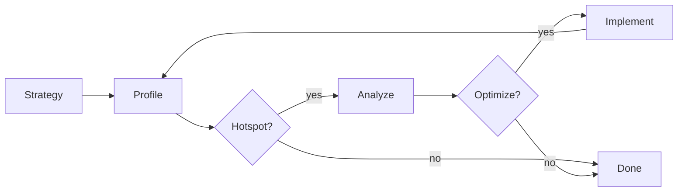

# Performance Profiling

Profile & optimize trading strategy execution speed.

**When**: Strategy >100ms, backtest >10s, or optimization >1m/trial.

## Profile

| Tool | Use Case | Cmd |
|-------|-----------|------|
| cProfile | Func-level hotspots | `-m cProfile -o prof.out` |
| line_profiler | Line-by-line | `kernprof -l -v script.py` |
| py-spy | Realtime viz | `py-spy record -o out.svg --pid <pid>` |
| memory_profiler | Mem usage | `-m memory_profiler` |



## Bottlenecks

| Area | Symptom | Fix |
|-------|----------|-----|
| Vectorization | `for` loops | `np.where()`, `df.apply()` |
| Indicator calc | Recomputing | Cache in df cols |
| Signal gen | Per-bar if | Boolean masks |
| Backtest | Position tracking | Vectorized cumsum |
| Type conv | `int()`→`float` | Pre-convert arrays |

## Optimization Patterns

**Vectorization**: Replace loops with numpy/pandas ops
```python
# SLOW
signals = []
for i in range(len(df)):
    if df['rsi'].iloc[i] < 30:
        signals.append(1)

# FAST
signals = (df['rsi'] < 30).astype(int)
```

**Caching**: Store computed values
```python
# SLOW
for i in range(len(df)):
    rsi = compute_rsi(df['close'], i, 14)

# FAST
df['rsi'] = compute_rsi_vectorized(df['close'], 14)
```

**Boolean Masks**: Replace conditionals
```python
# SLOW
direction = 0
if long_cond:
    direction = 1
elif short_cond:
    direction = -1

# FAST
direction = np.where(long_cond, 1, np.where(short_cond, -1, 0))
```

**Dtypes**: Use optimal types
```python
# SLOW
df['timestamp'] = df['timestamp'].astype(int)

# FAST
df['timestamp'] = df['timestamp'].astype(np.int64)
df['close'] = df['close'].astype(np.float64)
```

## Metrics

| Metric | Target | Measure |
|---------|--------|---------|
| Strategy gen | <10ms (10k bars) | `time.time()` |
| Indicator calc | <5ms (10k bars) | `line_profiler` |
| Backtest | <100ms (10k bars) | Vectorized |
| Memory | <100MB (10k bars) | `memory_profiler` |

## Validate

```python
import time
import numpy as np

def benchmark(strategy, context):
    """Profile strategy execution time."""
    n_runs = 100
    times = []

    for _ in range(n_runs):
        start = time.perf_counter()
        strategy.generate(context)
        times.append(time.perf_counter() - start)

    mean_ms = np.mean(times) * 1000
    std_ms = np.std(times) * 1000

    print(f"Mean: {mean_ms:.2f}ms ± {std_ms:.2f}ms")
    return mean_ms < 10
```

## Regression Detection

When performance degraded between branches:

### 1. Profile Current
```bash
python -m cProfile -o current.prof <command>
python -c "import pstats; pstats.Stats('current.prof').sort_stats('cumulative').print_stats(30)"
```

### 2. Profile Reference
```bash
git stash && git checkout <ref-branch>
python -m cProfile -o reference.prof <command>
git checkout - && git stash pop
```

### 3. Compare
```python
import pstats

def get_top(prof, n=50):
    s = pstats.Stats(prof)
    s.calc_callees()
    return {k: (v[2], v[3]) for k, v in list(s.stats.items())[:n]}

cur, ref = get_top('current.prof'), get_top('reference.prof')
for f, (cum, calls) in sorted(cur.items(), key=lambda x: -x[1][0])[:20]:
    ref_cum, _ = ref.get(f, (0, 0))
    if ref_cum > 0 and (ratio := cum / ref_cum) not in (0.67, 1.5):
        print(f"{ratio:.2f}x: {f}")
```

### 4. Find Culprit
```bash
git diff <ref-branch>...HEAD -- <hotspot-files>
```

## Common Issues

| Issue | Cause | Solution |
|-------|--------|----------|
| Slow indexing | `.iloc` in loops | Vectorize or use `.values` |
| Chained ops | `df['a'] + df['b']` | Compute once |
| String ops | Type conversion | Pre-convert dtypes |
| Memory leak | Growing lists | Pre-allocate arrays |
| Copy overhead | `.copy()` everywhere | Use views `[:10]` |
| Import in func | Repeated imports | Move to module level |
| iterrows() | Slow iteration | Use `.itertuples()` |

## Rust Migration

When Python optimization exhausted:

**Candidates**:
- Backtest engine (high compute)
- Indicator calcs (vectorizable)
- Signal generation (rule-based)

**Pattern**:
```python
# Python
def compute_rsi(prices, period):
    delta = np.diff(prices)
    gain = np.where(delta > 0, delta, 0)
    loss = np.where(delta < 0, -delta, 0)

# Rust
pub fn compute_rsi(prices: &[f64], period: usize) -> Vec<f64> {
    // Use iterators for zero-copy
    prices.windows(period)
        .map(|w| rsi_window(w))
        .collect()
}
```
