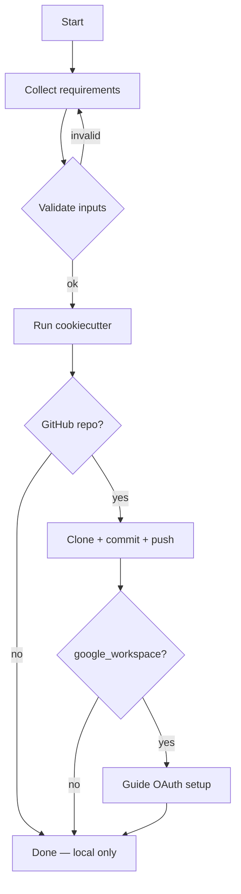

## Intent

Interactively collect project requirements and generate a polylith-structured Python project using cookiecutter.

## Structure

```
polylith-generator/SKILL.md
└── references/
    ├── questionnaire.md
    ├── github-integration.md
    └── oauth-flow.md
```

## Workflow



## Variable Mapping

| Question | Variable | Default |
|----------|----------|---------|
| Project name | project_name | "My Polylith Project" |
| (derived) | project_slug | project_name.lower().replace(' ', '_') |
| (derived) | namespace | project_slug.replace('-', '_') |
| Author | author_name | "Your Name" |
| Python version | python_version | "3.13" |
| Rust backend? | include_rust_backend | "y" |
| Google Workspace? | include_google_workspace | "y" |
| Streamlit app? | include_streamlit_app | "y" |
| DVC pipeline? | include_dvc_pipeline | "y" |
| Examples? | include_examples | "y" |

5 boolean toggles, all default "y". Namespace = project_slug (hyphens→underscores).

## Rules

| Check | Rule |
|-------|------|
| force push | NEVER use `git push --force` |
| public repo | Confirm before pushing to public repos |
| inputs | Validate all inputs before cookiecutter |
| OAuth | Guide browser consent, never automate credentials |
| cleanup | Remove generated project on failure |

## Commands

| Category | Tool | Purpose |
|----------|------|---------|
| template | `cookiecutter` | Generate project from template |
| git | `git` | Init, add, commit, push |
| github | `gh` | Auth check, repo create/clone |

## Refs

- [questionnaire](references/questionnaire.md) - Questions and validation rules
- [github integration](references/github-integration.md) - gh CLI patterns
- [oauth flow](references/oauth-flow.md) - Google Workspace OAuth guidance
