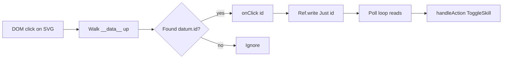

# purs-vega-playwright

PureScript 0.15 + Vega FFI patterns and Playwright headless testing.

## Quick Refs

| Topic | File |
|-------|------|
| Vega FFI patterns & pitfalls | `references/vega-purescript.md` |
| Playwright + snap Chromium setup | `references/playwright-chromium.md` |

## Critical FFI Rules

| Rule | Why |
|------|-----|
| `Effect a` = JS thunk `() => a` | PS compiles `Effect Unit` as `() → Unit`. Call `fn(arg)()` not `fn(arg)` |
| `Maybe a`: `Nothing→null`, `Just x→x` | `{tag:"Just",value:x}` crashes at runtime |
| Vega encode props need `{value:…}` | Bare `num 34` → ignored. Use `val(num 34)` → `{"value":34}` |
| `vega-embed` = default export | `import vegaEmbed from "vega-embed"` not `{ embed }` |

## Vega Click Handling



`view.addEventListener("click",…)` unreliable in Vega v6 SVG. Use direct DOM listener + `__data__` walk instead.

## FFI Template

```js
import vegaEmbed from "vega-embed";
var _views = {};
export const embedView = function(elId) {
  return function(spec) {
    return function(nodes) {
      return function(edges) {
        return function(onClick) {
          return function() {
            var el = document.getElementById(elId);
            if (!el) return;
            if (_views[elId]) { _views[elId].finalize(); delete _views[elId]; }
            vegaEmbed("#" + elId, spec, {actions:false, renderer:"svg"})
              .then(function(r) {
                _views[elId] = r;
                r.view.insert("nodes", nodes).run();
                r.view.insert("edges", edges).run();
                var svg = el.querySelector("svg");
                if (svg) svg.addEventListener("click", function(e) {
                  var t = e.target;
                  while (t && t !== svg) {
                    var d = t.__data__;
                    if (d && d.datum && d.datum.id) { onClick(d.datum.id)(); return; }
                    t = t.parentElement;
                  }
                });
              }).catch(function(err) { console.error("[vega-embed]", err); });
          };
        };
      };
    };
  };
};
```

## Playwright Snap Chromium

| Issue | Fix |
|-------|-----|
| Playwright can't find Chrome at `/opt/google/chrome/chrome` | Use `executablePath: '/snap/bin/chromium'` |
| Playwright MCP fails | Can't create `/opt/google/chrome` symlink without sudo — use CLI directly |
| Bundle cache | Use fresh port per test run OR cache-bust URL param |
| `page2.setCacheEnabled` | Not available on Page — use `browser.newContext()` |
| No image support | Use `page.evaluate()` to extract data programmatically |

```js
const { chromium } = require('playwright');
const browser = await chromium.launch({ executablePath: '/snap/bin/chromium', headless: true });
```

## Vega Spec Gotchas

| Issue | Detail |
|-------|--------|
| Schema version mismatch | Use `vega/v6.json` for Vega 6.x, `vega-lite/v5.json` for Vega-Lite 5 |
| `autosize: "fit"` squishes | Use `"x"` with computed aspect ratio from data bounds |
| Image marks default 256×256 | If `width`/`height` in encode ignored → check `{value:…}` wrapper |
| Rect marks render as `<path>` | SVG rects become rounded-corner paths; check `d` attr for dimensions |
| `__data__` structure | `target.__data__.datum.id` not `target.__data__.id` (nested) |
| Signal selectors | `"image:pointerup!"` matches ALL image marks by marktype, not by name |

## Poll Loop Pattern (avoid Halogen.Subscription)

```purescript
clickRef <- H.liftEffect $ Ref.new Nothing
let poll = do
  H.liftAff $ delay (Milliseconds 80.0)
  m <- H.liftEffect $ Ref.read clickRef
  case m of
    Just id -> H.liftEffect (Ref.write Nothing clickRef) *> handleAction (ToggleSkill id)
    Nothing -> pure unit
  poll
void $ H.fork poll
```

Avoids `Halogen.Subscription` which causes InfiniteType compiler bug in some PS 0.15 projects.
