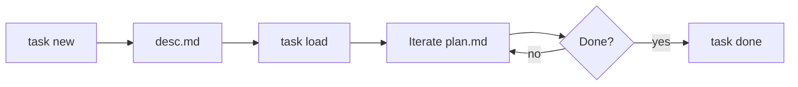

## Intent

Lightweight task management per-project. Tasks stored locally in `.queue/` folder, loadable across sessions for plan iteration.

## Structure

```
.queue/
├── 001_short_desc/
│   ├── desc.md        # task description (user intent)
│   └── plan.md        # iteration plan (agent + user)
├── 002_another_task/
│   ├── desc.md
│   └── plan.md
└── .meta              # next_id counter
```

## Rules

| Field | Constraint |
|-------|------------|
| id | Zero-padded 3-digit: `001`, `002`, ... |
| short_desc | kebab-case, ≤32c, no spaces |
| desc.md | Required: task description |
| plan.md | Optional: iteration plan |

## Commands

| Cmd | Syntax | Action |
|-----|--------|--------|
| new | `task new <short_desc>` | Create `NNN_short_desc/desc.md` |
| load | `task load <id>` | Read desc.md + plan.md into context |
| plan | `task plan <id>` | Open/iterate on plan.md |
| ls | `task ls` | List all tasks |
| rm | `task rm <id>` | Delete task folder |
| done | `task done <id>` | Archive to `.queue/.archive/` |

## Workflow



## Usage

**Create task**:
```bash
task new implement-auth
# → .queue/001_implement-auth/desc.md
```

**Load into session**:
```
task load 001
# Agent reads desc.md + plan.md into context
```

**Iterate plan**:
```
task plan 001
# Open plan.md for editing with user
```

## File Templates

**desc.md**:
```markdown
# Task: <short_desc>
Created: <dt>
Status: pending

## Intent
<what user wants>

## Context
<relevant files, constraints>

## Acceptance
<done criteria>
```

**plan.md**:
```markdown
# Plan: <short_desc>
Updated: <dt>

## Approach
<high-level strategy>

## Steps
- [ ] Step 1
- [ ] Step 2

## Notes
<iteration history>
```

## Local Memory

`local-memory.md` tracks last accessed task:

```yaml
last_updated: <dt>
project_path: <path>
last_task_id: <id>
active_tasks: [<id>, ...]
```

## Refs

- [queue-operations](references/queue-operations.md) - Extended cmd reference
